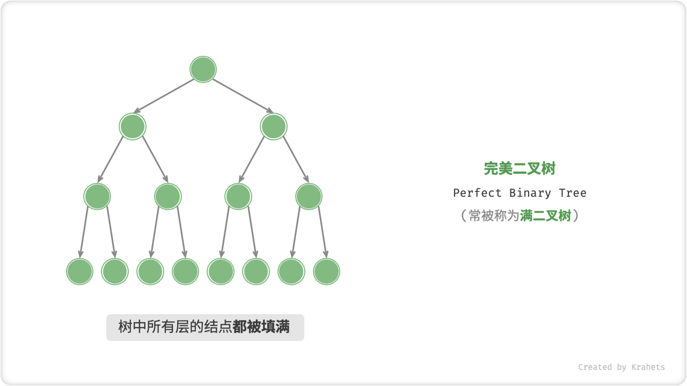
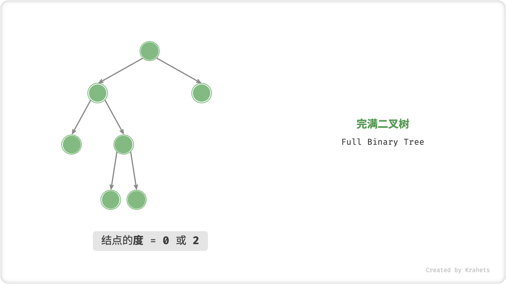
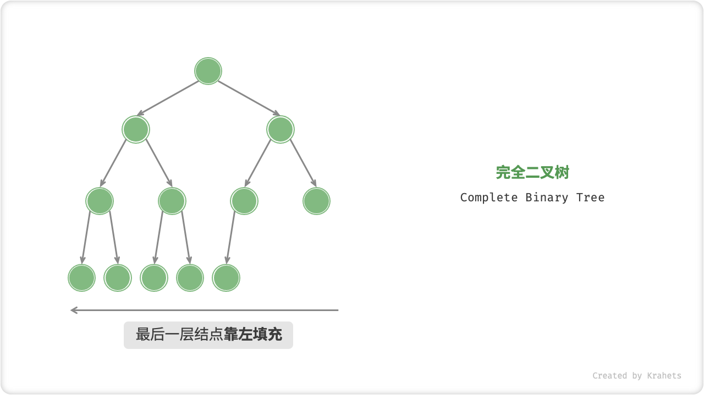
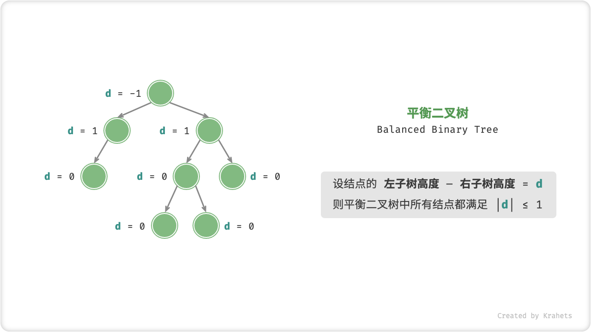
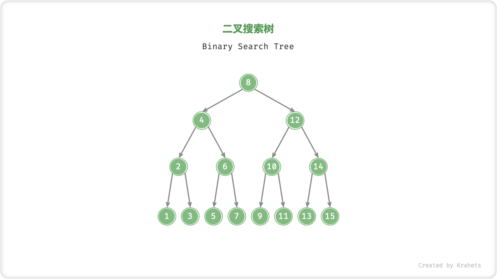
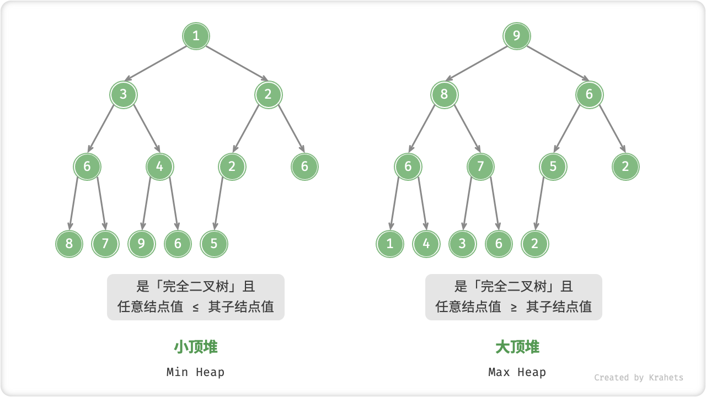
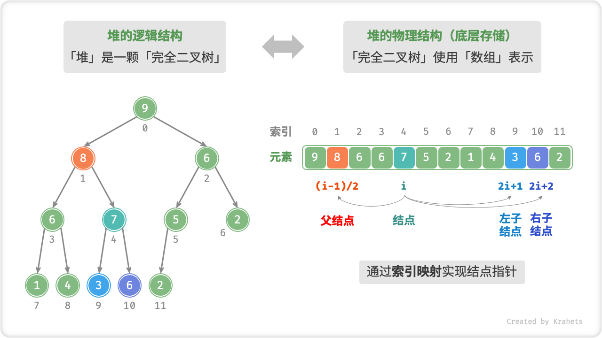

## 数据结构与算法之美

## 1. 复杂度分析

它是评价算法的 "标尺"，告诉我们执行某个算法需要的时间和空间，也可以此来展开不同算法之间的对比。而大 $O$ 复杂度表示法表示的只是一种变化趋势。

### 1.1 时间复杂度

我们只需要去关注循环执行次数最多的代码，其他部分代码忽略，并使用以下两个法则

- 加法法则: 代码总的复杂度等于量级最大的那段代码的复杂度
- 乘法法则: 嵌套代码的复杂度等于嵌套内外代码复杂度的乘积

- $O(n^2)$

```java
int sum = 0;
for(int i = 0; i < n; i++){
  sum += i;
  for (int j = 0; j < n; j++) {
    sum += j;    
  }
}
```

第5行代码执行次数为 $n$，第3行代码执行次数为 $n$，根据乘法法则，嵌套代码复杂度需要进行乘积

- $O(logn)$

```java
int i = 1;
while (i <= n) {
    i = i * 2;    
}
```

我们只需要关注第3行代码，而i的变化序列为 $2, 4, 8, 16...$，所以这段代码的时间复杂度为$O(logn)$

### 1.2 空间复杂度
空间复杂度指的是**除原本的数据存储空间以外**，算法运行过程中还需要的额外存储空间。

比如用数组实现栈数据结构，栈中虽有大小为$n$的数组，但是并不代表它的空间复杂度为$O(n)$，而是只关注数组之外的一些临时变量，因此它的空间复杂度为$O(1)$

## 2. 数据结构

**所有数据结构都是基于数组或链表或两者组合实现的**

### 2.1 数组
数组是线性的数据结构，占用连续的内存空间存储一组相同类型的数据，正因如此，数组**支持随机访问**，即在 $O(1)$ 时间复杂度内按照索引快速访问数组中的元素。
但是它的插入、删除操作也因此变得低效，平均时间复杂度为 $O(n)$

### 2.2 链表
链表也是线性数据结构，与数组不同的是它不需要占用连续的内存空间，但是需要额外的空间保存后继节点的指针，以此将所有的链表节点串联起来。
它的删除和插入操作比较高效，时间复杂度为 $O(1)$，但是想访问链表中某个值时，需要对链表进行遍历，时间复杂度为 $O(n)$

### 2.3 背包
支持添加和遍历元素，但是不支持删除元素。

### 2.4 栈
- 应用: 函数调用栈、括号的匹配、双栈实现浏览器的前进和后退功能、JVM栈、电子邮件的存放、算数表达式的求值(操作数栈和运算符栈)

### 2.5 二叉树
二叉树是一种非线性数据结构，代表着“一分为二”的分治思想。二叉树的结点包含「值」和两个「指针」，分别指向左子结点和右子结点。

#### 完美二叉树
在完美二叉树中，所有结点的度 = 2 ；若树高度 = h ，则结点总数 = $2^(h + 1) - 1$，呈标准的指数级关系，反映着自然界中常见的细胞分裂。



#### 完满二叉树
除了叶结点之外，其余所有结点都有两个子结点。



#### 完全二叉树
「完全二叉树 Complete Binary Tree」只有最底层的结点未被填满，且最底层结点尽量靠左填充。

**完全二叉树非常适合用数组来表示**。如果按照层序遍历序列的顺序来存储，那么空结点 null 一定全部出现在序列的尾部，因此我们就可以不用存储这些 null 了。



#### 平衡二叉树
「平衡二叉树 Balanced Binary Tree」中任意结点的左子树和右子树的高度之差的绝对值 ≤ 1



#### 二叉搜索树
「二叉搜索树 Binary Search Tree」满足以下条件：
1. 对于根结点，左子树中所有结点的值 < 根结点的值 < 右子树中所有结点的值
2. 任意结点的左子树和右子树也是二叉搜索树，即也满足条件 1

（二叉搜索树不允许存在重复结点，否则将会违背其定义）



#### AVL树
「AVL 树」既是「二叉搜索树」又是「平衡二叉树」，同时满足这两种二叉树的所有性质，因此又被称为「平衡二叉搜索树」，它能在不断地添加和删除节点时保证AVL树不发生退化。

AVL树的独特之处在于旋转操作（左旋，先左旋再右旋，右旋，先右旋再左旋），其可**在不影响二叉树中序遍历的前提下，使失衡结点回复平衡**

### 2.6 堆（优先队列）

「堆 Heap」是一棵限定条件下的「完全二叉树」。根据成立条件，堆主要分为两种类型：
- 「小顶堆 Min Heap」，任意结点的值 ≤ 其子结点的值
- 「大顶堆 Max Heap」，任意结点的值 ≥ 其子结点的值



其中二叉树中的根结点对应「堆顶」，底层最靠右结点对应「堆底」。

#### 堆的存储与表示

「完全二叉树」非常适合使用「数组」来表示，给定索引 $i$，那么其左子结点索引为 $2i + 1$、右子结点索引为 $2i + 2$、父结点索引为 $(i - 1) / 2$，若索引越界，则代表空结点或结点不存在。



#### 元素入堆

以大顶堆为例，先将其添加至堆底，由于该值可能大于堆中其他元素，所以要从底至顶执行堆化。具体步骤: 比较该值与其父结点的大小，若插入结点更大则将它们交换，
直至遇到无需交换的结点或越过数组范围时结束。

[元素入堆图示](https://www.hello-algo.com/chapter_heap/heap/#_3)

[//]: # (![img_2.png]&#40;src/main/resources/images/heap/img_2.png&#41;)

[//]: # ()
[//]: # (![img_3.png]&#40;src/main/resources/images/heap/img_3.png&#41;)

[//]: # ()
[//]: # (![img_4.png]&#40;src/main/resources/images/heap/img_4.png&#41;)

[//]: # ()
[//]: # (![img_5.png]&#40;src/main/resources/images/heap/img_5.png&#41;)

[//]: # ()
[//]: # (![img_6.png]&#40;src/main/resources/images/heap/img_6.png&#41;)

- **时间复杂度**: $O(logn)$

#### 堆顶元素出堆

大顶堆堆顶元素出堆步骤
1. 交换堆顶元素和堆底元素
2. 交换完成后，将堆底元素删除
3. 从根节点开始，从顶至底执行堆化

与元素入堆相比，出堆堆化与入堆堆化方向相反，比较的是根结点和其最大子结点的值，
若根节点小于该子结点，则执行交换，循环该步骤，直至无需交换或者越过数组范围时结束。

[元素出堆图示](https://www.hello-algo.com/chapter_heap/heap/#_4)

[//]: # (![img_7.png]&#40;src/main/resources/images/heap/img_7.png&#41;)

[//]: # ()
[//]: # (![img_8.png]&#40;src/main/resources/images/heap/img_8.png&#41;)

[//]: # ()
[//]: # (![img_9.png]&#40;src/main/resources/images/heap/img_9.png&#41;)

[//]: # ()
[//]: # (![img_10.png]&#40;src/main/resources/images/heap/img_10.png&#41;)

[//]: # ()
[//]: # (![img_11.png]&#40;src/main/resources/images/heap/img_11.png&#41;)

[//]: # ()
[//]: # (![img_12.png]&#40;src/main/resources/images/heap/img_12.png&#41;)

[//]: # ()
[//]: # (![img_13.png]&#40;src/main/resources/images/heap/img_13.png&#41;)

[//]: # ()
[//]: # (![img_14.png]&#40;src/main/resources/images/heap/img_14.png&#41;)

[//]: # ()
[//]: # (![img_15.png]&#40;src/main/resources/images/heap/img_15.png&#41;)

[//]: # ()
[//]: # (![img_16.png]&#40;src/main/resources/images/heap/img_16.png&#41;)

### 2.7 哈希表

#### 哈希表高效扩容的方案

存在1GB的哈希表需要扩容，如果在插入元素使先将数据从旧哈希表搬迁到新哈希表，那么会非常耗时，为了避免这种情况，可以在每次插入新数据时只搬迁一部分数据到新哈希表，
每次插入都重复执行这个动作，经过多次数据插入后，数据迁移就完成了，这样使得分摊到每次插入操作的时间复杂度为 $O(1)$，但是这也存在新旧哈希表占用空间和查询数据需要
在两个哈希表中都要查找的问题。

#### 哈希冲突解决方案的应用

- **开放寻址法**: 适合数据量较小，装载因子小的场景，因为它的数据全存在数组中，更容易发生哈希冲突，所以装载因子不能太大。ThreadLocalMap使用该方法。
- **链表法**: HashMap、LinkedHashMap使用该方法。

#### LRUCache(Least Recently Used Cache)

```java
public class LRUCache {

    private static class LinkedNode {
        public int key;
        public int value;

        public LinkedNode prev;
        public LinkedNode next;

        public LinkedNode(int key, int value) {
            this.key = key;
            this.value = value;
        }
    }

    private final Map<Integer, LinkedNode> cache = new HashMap<>();
    private int size;
    public int capacity;

    private final LinkedNode head;
    private final LinkedNode tail;

    public LRUCache(int capacity) {
        this.size = 0;
        this.capacity = capacity;

        // 哨兵结点
        this.head = new LinkedNode(-1, -1);
        this.tail = new LinkedNode(-1, -1);
        head.next = tail;
        tail.prev = head;
    }

    /**
     * LRU查找结点，存在的话将该节点移到头结点
     */
    public int get(int key) {
        LinkedNode node = cache.get(key);
        if (node != null) {
            removeNode(node);
            addHead(node);

            return node.value;
        } else {
            return -1;
        }
    }

    public void put(int key, int value) {
        LinkedNode node = cache.get(key);
        if (node != null) {
            node.value = value;

            removeNode(node);
            addHead(node);
        } else {
            LinkedNode newNode = new LinkedNode(key, value);
            // 容量满了的话，得删掉尾巴节点
            if (size == capacity) {
                cache.remove(tail.prev.key);
                removeNode(tail.prev);
                size--;
            }

            addHead(newNode);
            cache.put(key, newNode);
        }

        size++;
    }

    public void remove(int key) {
        LinkedNode node = cache.get(key);
        if (node != null) {
            size--;
            removeNode(node);
            cache.remove(key);
        }
    }

    private void removeNode(LinkedNode node) {
        node.prev.next = node.next;
        node.next.prev = node.prev;
    }

    private void addHead(LinkedNode node) {
        head.next.prev = node;
        node.next = head.next;
        head.next = node;
        node.prev = head;
    }

    public void print() {
        if (size > 0) {
            StringBuilder res = new StringBuilder("LinkedList: {");
            LinkedNode temp = head.next;
            while (temp.key != -1) {
                res.append(temp.value).append(",");
                temp = temp.next;
            }
            res.replace(res.length() - 1, res.length(), "");
            res.append("}");

            StringBuilder cacheRes = new StringBuilder("Cache: {");
            for (LinkedNode value : cache.values()) {
                cacheRes.append(value.value).append(",");
            }
            cacheRes.replace(cacheRes.length() - 1, cacheRes.length(), "");
            cacheRes.append("}");

            System.out.println(res);
            System.out.println(cacheRes);
        }
    }
}
```

#### 哈希表的特殊形式: 位图

位图用来判断大范围数据中某个数是否存在非常合适，占用空间极小，因为每个数字仅用0或1一**位**来标记。但是在Java这种高级语言中，布尔值占用多个字节，
远远比**位**大，所以 可以通过使用字符数组来表示位图，每个char字符是2字节即16位，那么每个元素就能表示16个数字的存在情况，通过 `num / 16` 定位到它在字符数组中的位置，
通过 `num % 16` 来找到该元素在该字符下的哪个二进制位上，存在为1不存在为0。

```java
public class BitMap {
    // 每个字符是16位 用于表示16个数字的存在情况
    private final char[] bytes;

    // 数据量大小
    private final int bits;

    public BitMap(int bits) {
        this.bits = bits;
        this.bytes = new char[bits / 16 + 1];
    }

    public void set(int num) {
        if (num > bits) {
            return;
        }

        int byteIndex = num / 16;
        // 标记该数字在数组中存在
        bytes[byteIndex] |= (1 << num % 16);
    }

    public boolean get(int num) {
        if (num > bits) {
            return false;
        } else {
            int byteIndex = num / 16;

            return (bytes[byteIndex] & (1 << num % 16)) != 0;
        }
    }
}
```

## 3. 递归
**不要试图模拟计算机递归调用的过程！** **不要试图用你聪明的大脑去分解递归的每个步骤！** 而是思考递推公式，找出终止条件，然后将以上信息"翻译"成代码！

递归调用存在如下两个问题
- 警惕递归代码出现堆栈溢出
- 警惕递归代码出现的重复计算问题: 使用 **备忘录** 来解决

比如，爬n阶台阶的问题
```java
    /**
     * 爬台阶问题
     * <p>
     * 递推公式: f(n) = f(n - 1) + f(n - 2)
     * 终止条件: 爬到第1或第2阶台阶
     * <p>
     * 备忘录: 当计算5阶台阶时，会计算4阶台阶和3阶台阶，计算4阶台阶时还会计算3阶台阶，3阶台阶的计算是重复的
     * 所以我们可以依靠备忘录来解决重复计算的问题
     */
    private static int recursion(int n) {
        if (n == 1 || n == 2) {
            return n;
        }

        if (map.containsKey(n)) {
            return map.get(n);
        }
        int res = recursion(n - 1) + recursion(n - 2);
        map.put(n, res);
        
        return res;
    }

    // 备忘录
    private static final HashMap<Integer, Integer> map = new HashMap<>(16);
```

- 空间复杂度: $O(n)$ ，递归代码的空间复杂度等于最大深度乘以每层递归调用的空间消耗，每层递归空间消耗为常量级，而栈的最大深度为n所以为 $O(n)$

## 4. 排序算法
- 算法特性
  - 稳定性: 经排序后，若等值元素之间的相对位置不变则为稳定排序算法，否则为不稳定排序算法
  - 原地排序: 是否借助额外辅助空间
  - 自适应性: 自适应性排序受输入数据的影响，即最佳/平均/最差时间复杂度不等，而非自适应排序时间复杂度恒定

- 排序算法执行效率的分析
  - 最佳/平均/最差时间复杂度或**有序度和逆序度**的方法
  - 时间复杂度的系数、常数和低阶，我们在就散时间复杂度时会忽略这些，但是在实际开发中需要将这些因素根据数据规模考虑进来
  - 比较和交换次数

- 对小规模数据，我们可以选用时间复杂度为 $O(n^2)$ 的排序算法，因为时间复杂度并不代表实际代码的执行时间，而且它也省去了低阶、系数和常数，
  仅代表的增长趋势，所以在小规模数据情况下，$O(n^2)$ 的排序算法可能会比 $O(nlogn)$ 的排序算法执行效率高。
  不过随着数据规模增大，$O(nlogn)$的排序算法是不二选择。

### 4.1 $O(n^2)$
**插入排序**在实际开发中应用广泛，冒泡排序和选择排序熟悉就好

#### 4.1.1 冒泡排序
```java
    private static void bubbleSortImprove(int[] nums) {
        for (int i = nums.length - 1; i > 0; i--) {
            // 优化标志位: 如果未发生交换则证明已经有序
            boolean flag = false;
            for (int j = 0; j < i; j++) {
                // 比较并交换位置
                if (nums[j] > nums[j + 1]) {
                    int temp = nums[j];
                    nums[j] = nums[j + 1];
                    nums[j + 1] = temp;

                    flag = true;
                }
            }

            if (!flag) {
                break;
            }
        }
    }
```
- **空间复杂度**: $O(1)$
- **原地排序**
- **稳定排序**
- **自适应排序**: 经过优化后最佳时间复杂度为 $O(n)$

#### 4.1.2 插入排序

- 核心思想: 取未排序区间中的某个元素为基准数 `base`，将 `base` 与其左侧已排序区间元素依次比较大小，并"插入"到正确位置

```java
    private static void insertSort(int[] nums) {
        for (int i = 1; i < nums.length; i++) {
            // 选取未排序区间的基准数
            int base = nums[i];

            // 排序区间数若比基准数大，则后移，直到找到合适的位置插入
            int j = i - 1;
            while (j >= 0 && nums[j] > base) {
                nums[j + 1] = nums[j];
                j--;
            }
            nums[j + 1] = base;
        }
    }
```

- **空间复杂度**: $O(1)$
- **原地排序**
- **稳定排序**
- **自适应排序**: 最佳时间复杂度为 $O(n)$

#### 4.1.3 选择排序

- 核心思想: 每次从未排序区间中找到最小的元素，将其放到已排序区间的末尾

```java
    private static void selectionSort(int[] nums) {
        // 循环n-1次即可
        for (int i = 0; i < nums.length - 1; i++) {
            int minIndex = i;
            // 寻找最小值
            for (int j = i + 1; j < nums.length; j++) {
                if (nums[j] < nums[minIndex]) {
                    minIndex = j;
                }
            }

            // 交换位置
            int temp = nums[i];
            nums[i] = nums[minIndex];
            nums[minIndex] = temp;
        }
    }
```

- **空间复杂度**: $O(1)$
- **原地排序**
- **非稳定排序**: 会改变等值元素之间的相对位置
- **非自适应排序**: 最好/平均/最坏时间复杂度均为 $O(n^2)$

### 4.2 $O(nlogn)$

归并排序和快速排序都是基于分治算法的思想实现的排序，但是快速排序应用更加广泛

#### 4.2.1 归并排序

- 核心思想: 采用分治算法思想，分**划分**和**合并**两个阶段。
  划分阶段不断将数组从中点位置分开，直到划分长度为1；合并阶段是将划分后的排序数组合并排序的长数组

```java
    private static void mergeSort(int[] nums, int left, int right) {
        if (left >= right) {
            return;
        }

        // 划分阶段，不断地从中点划分
        int mid = (left + right) / 2;
        mergeSort(nums, left, mid);
        mergeSort(nums, mid + 1, right);
        
        // 合并阶段
        merge(nums, left, mid, right);
    }

    private static void merge(int[] nums, int left, int mid, int right) {
        // 辅助数组，注意该数组取的是原数组[left, right]范围
        int[] temp = Arrays.copyOfRange(nums, left, right + 1);

        // 左数组 在辅助数组的范围
        int leftBegin = 0, leftEnd = mid - left;
        // 右数组 在辅助数组的范围
        int rightBegin = mid + 1 - left, rightEnd = right - left;

        // 在原数组的范围内直接借助左右数组覆盖
        for (int i = left; i <= right; i++) {
            // 左数组用完了直接赋值右数组
            if (leftBegin > leftEnd) {
                nums[i] = temp[rightBegin++];
            } else if (rightBegin > rightEnd || temp[leftBegin] <= temp[rightBegin]) {
                // 右数组用完了或者左数组数小
                nums[i] = temp[leftBegin++];
            } else {
                // 左右数组都没用完，但是左数组比较大
                nums[i] = temp[rightBegin++];
            }
        }
    }
```

注意在左右数组比较的逻辑里，一定要把**判断越界的逻辑写到条件判断靠前的位置**！

观察归并排序划分阶段的代码，其实就是二叉树的后序遍历

- **空间复杂度**: 借助辅助数组实现合并，使用 $O(n)$ 的额外空间；递归深度为 $logn$，使用 $O(logn)$ 大小的栈帧空间。
  忽略低阶部分，所以空间复杂度为 $O(n)$
- **非原地排序**
- **稳定排序**
- **非自适应排序**

> 归并排序的时间复杂度一直是 $O(nlogn)$，而快速排序在最坏的情况下时间复杂度为 $O(n^2)$，为什么归并排序没有快速排序应用广泛呢？
答: 因为归并排序是非原地排序，在合并阶段需要借助非常量级的额外空间

#### 4.2.2 快速排序

- 核心思想: 快速排序同样基于分治算法的思想，与归并排序不同的是归并排序从上到下进行处理，先处理子问题，而快速排序处理过程有上到下，先分区，再处理子问题。
  快速排序的核心操作为 **哨兵划分**，选取数组中某个数为基准数，将小于基准数的排在左边，大于基准数的排在右边，之后再对两个小数组分别执行快速排序。

```java
    private static void quickSort(int[] nums, int left, int right) {
        if (left >= right) {
            return;
        }

        // 哨兵划分
        int partition = partition(nums, left, right);
        
        // 分别排序两个子数组
        quickSort(nums, left, partition - 1);
        quickSort(nums, partition + 1, right);
    }

    /**
     * 哨兵划分
     */
    private static int partition(int[] nums, int left, int right) {
        // 以 nums[left] 作为基准数，并记录基准数索引
        int base = nums[left];
        int baseIndex = left;

        while (left < right) {
            while (left < right && nums[right] >= base)
                right--;             // 从右向左找首个小于基准数的元素
            while (left < right && nums[left] <= base)
                left++;              // 从左向右找首个大于基准数的元素
            swap(nums, left, right); // 交换这两个元素
        }
        swap(nums, baseIndex, left); // 将基准数交换到两子数组的分界线
        return left;                 // 返回基准数索引
    }

    private static void swap(int[] nums, int left, int right) {
        int temp = nums[left];
        nums[left] = nums[right];
        nums[right] = temp;
    }
```

- **平均时间复杂度**: $O(nlogn)$
- **最差时间复杂度**: $O(n^2)$
- **空间复杂度**: 最差情况下，递归深度为n，所以空间复杂度为 $O(n)$
- **原地排序**
- **非稳定排序**
- **自适应排序**

##### 快速排序基准数选择的优化

如果数组为倒序的情况下，选择最左端元素为基准数，那么每次哨兵划分会导致右数组长度为0，进而使快速排序退化成冒泡排序，为了尽可能避免这种情况，
我们可以对基准数的选择进行优化

```java
    /**
     * 优化基准数选择，在最左元素、中间元素和最右元素中选取其中的中位数作为基准数
     * 基准数的索引为left，所以找到中位数后交换位置即可，若最左即为中位数则不做处理
     */
    private static void betterBase(int[] nums, int left, int right) {
        int mid = (left + right) / 2;

        // 异或 相同为0 不同为1，那么只要满足该数据比其中一个大其中一个小即为中位数
        if ((nums[right] < nums[mid]) ^ (nums[right] < nums[right])) {
            swap(nums, left, right);
        } else if ((nums[mid] < nums[left]) ^ (nums[mid] < nums[right])) {
            swap(nums, left, mid);
        }
    }
```

### 4.3 $O(n)$
桶排序、计数排序和基数排序，时间复杂度都为 $O(n)$，也称为线性排序，它们都不是基于比较的排序算法。

#### 4.3.1 桶排序

- 核心思想: 定义几个有序的"桶"，将要排序的数据分别放到这几个"桶"里，对每个桶里的数据单独进行排序，再把每个"桶"里的数据按照顺序依次取出，结果便是有序的。

桶排序的时间复杂度虽然为$O(n)$，但是它对数据是有要求的，待排序数组需要容易划分成m个"桶"，并且"桶"与"桶"之间有着"天然"的大小顺序，
这样在每个桶中的值排序完成后，取出结果便是有序的

```java
    /**
     * 桶排序
     * 指定数据范围为0 - 50，分桶为5个，每10个数为一个桶
     */
    @SuppressWarnings("unchecked")
    private static void bucketSort(int[] nums) {
        // 声明5个桶
        ArrayList<Integer>[] buckets = new ArrayList[5];
        Arrays.fill(buckets, new ArrayList<Integer>());

        // 数组元素分桶
        intoBucket(buckets, nums);

        // 出桶
        outOfBucket(buckets, nums);
    }

    private static void intoBucket(ArrayList<Integer>[] buckets, int[] nums) {
        for (int num : nums) {
            int bucketIndex = num / 10;
            buckets[bucketIndex].add(num);
        }
    }

    private static void outOfBucket(ArrayList<Integer>[] buckets, int[] nums) {
        for (ArrayList<Integer> bucket : buckets) {
            // 先排序 再出桶
            bucket.sort(Comparator.comparingInt(x -> x));

            // 出桶覆盖原数组值
            int numsIndex = 0;
            for (Integer num : bucket) {
                nums[numsIndex++] = num;
            }
        }
    }
```

- **空间复杂度**: $O(n)$
- **非原地排序**
- **稳定排序**

- 桶排序非常适合用在外部排序中。比如，有10GB的订单需要按照金额排序，但是服务器的内存只有几百MB，那么该如何做？

采用桶排序的方法，假定金额为 $1 - 1000$ 且均匀分布，那么我们划分出100个桶，每个桶内的金额范围为10元，这样我们逐个将每个桶进行排序，
分别写到100个小文件中，这样按顺序读取这100个小文件写到大文件中，就完成了该排序。如果金额不是均匀分布的，那么我们对分到订单数量过多的桶再进行桶划分，
直到保证每个桶内的数据量满足内存大小要求。

#### 4.3.2 计数排序

计数排序是桶排序的一种特殊情况，与桶排序类似，只是桶的大小粒度不一样，计数排序桶的粒度是**非负整数的单位值**，即待排序数组中最大值为k，则划分成k + 1个桶。
我们以如下例子来理解计数排序。

```java
public class CountingSort {
    public static void main(String[] args) {
        // 假设8个考生，分数的范围是0 - 5分，他们的分数为[2, 5, 3, 0, 2, 3, 0, 3]，排序这些学生的分数
        int[] students = new int[]{2, 5, 3, 0, 2, 3, 0, 3};

        // 计数排序
        countingSort(students);

        System.out.println(Arrays.toString(students));
    }

  /**
   * 计数排序的计数体现在小于等于某个数出现的次数 - 1 即为该数在原数组排序后的位置
   */
  private static void countingSort(int[] nums) {
        if (nums.length <= 1) {
            return;
        }

        // 寻找数组中的最大值来以此定义max + 1个桶
        int max = nums[0];
        for (int i = 1; i < nums.length; i++) {
            if (nums[i] > max) {
                max = nums[i];
            }
        }

        // 定义桶，索引范围即数组值的最大范围，每个桶中保存的是该数字出现的次数，计数排序的计数概念出现
        int[] bucket = new int[max + 1];
        Arrays.fill(bucket, 0);

        // 计算每个数的个数在桶中累加
        for (int num : nums) {
            bucket[num]++;
        }
        // 依次累加桶中的数，该数表示小于等于该索引值的数量
        for (int i = 1; i < bucket.length; i++) {
            bucket[i] += bucket[i - 1];
        }

        // 创建临时数组来保存排序结果值
        int[] res = new int[nums.length];
        // 倒序遍历原数组
        for (int i = nums.length - 1; i >= 0; i--) {
            // 根据桶中的 计数 找出该数的索引
            int index = bucket[nums[i]] - 1;
            // 根据索引在结果数组中赋值
            res[index] = nums[i];
            // 该数分配完成后，需要将桶中的计数数量-1
            bucket[nums[i]]--;
        }

        // 结果数组覆盖原数组
        System.arraycopy(res, 0, nums, 0, res.length);
    }
}
```

- **从后往前遍历**保证计数排序为稳定性排序
- 时间复杂度为 $O(n)$，但是要保证数据在范围不大的场景下，否则就不适用计数排序了

#### 4.3.3 基数排序

基数排序是一种特殊的桶排序，基数体现在**待排序数据能够分割出独立的"位"，并且在"位"与"位"之间有递进关系**，比如整数可以分出个、十、百位等，且百位和十位存在递进关系。
基数排序的执行轮次和待排序数据最大值的长度一致。

```java
    /**
     * 基数排序 本例应用于整数排序
     */
    private static void radixSort(int[] nums) {
        if (nums.length <= 1) {
            return;
        }

        // 1. 整数的每位取值范围为 0-9，因此需要创建10个桶
        Queue<Integer>[] buckets = createBuckets();

        // 2. 获取基数排序的执行轮次
        int radixRounds = getRadixRounds(nums);

        // 3. 根据执行轮次处理各个"位"，eg: 第一轮处理个位...
        for (int round = 1; round <= radixRounds; round++) {
            for (int num : nums) {
                // 获取所在桶的索引
                int bucketIndex = getBucketIndex(num, round);
                // 进桶
                buckets[bucketIndex].offer(num);
            }

            // 出桶赋值，当前结果为根据当前位排序的结果
            int numsIndex = 0;
            for (Queue<Integer> bucket : buckets) {
                while (!bucket.isEmpty()) {
                    nums[numsIndex++] = bucket.poll();
                }
            }
        }
    }

    /**
     * 创建大小为10的数组作为桶，每个桶都是一个队列
     */
    @SuppressWarnings("unchecked")
    private static Queue<Integer>[] createBuckets() {
        Queue<Integer>[] buckets = new Queue[10];
        for (int i = 0; i < buckets.length; i++) {
            buckets[i] = new LinkedList<>();
        }

        return buckets;
    }

    /**
     * 获取基数排序的执行轮次
     */
    private static int getRadixRounds(int[] nums) {
        int max = nums[0];
        for (int num : nums) {
            if (num > max) {
                max = num;
            }
        }

        return String.valueOf(max).length();
    }

    /**
     * 获取该数所在桶的索引
     */
    private static int getBucketIndex(int num, int round) {
        int bucketIndex = 0;

        while (round != 0) {
            bucketIndex = num % 10;
            num /= 10;

            round--;
        }

        return bucketIndex;
    }
```

## 5. 查找算法

二分查找的时间复杂度是惊人的 $O(logn)$ ，甚至有时会比 $O(1)$ 时间复杂度的算法效率要高，因为时间复杂度仅仅代表的是增长趋势，
我们会省略其中的低阶常数等等，$O(1)$ 可能是比较大的值，如 $O(10000)$。

### 5.1 二分查找

分 **双闭区间** 和 **左闭右开** 区间的两种写法
- **双闭区间**: 定义两指针时，左右指针都在数组范围内，那么查找的结束条件便是 left > right

```java
    public static int doubleClose(int[] nums, int target) {
        int left = 0, right = nums.length - 1;

        // 搜索区间为空时结束循环，即 left > right
        while (left <= right) {
            int mid = (left + right) / 2;

            if (nums[mid] < target) {
                left = mid + 1;
            } else if (nums[mid] > target) {
                right = mid - 1;
            } else {
                return mid;
            }
        }

        return -1;
    }
```

其中mid值的计算可以进行优化，第一种写法是避免 `left + right` 的写法超过整数的表示范围，第二种是计算机更喜欢位运算

```java
int mid = left + (right - left) / 2;
int mid = left + (right - left) >> 1;
```

- **左闭右开**: 右边开区间则表示右指针不在查找的数组范围内，那么查找的结束条件便是 left = right

```java
    public static int leftCloseRightOpen(int[] nums, int target) {
        int left = 0, right = nums.length;

        // 搜索区间为空时结束循环，左闭右开区间为空的条件是 left = right
        while (left < right) {
            int mid = (left + right) / 2;

            if (nums[mid] < target) {
                left = mid + 1;
            } else if (nums[mid] > target) {
                right = mid;
            } else {
                return mid;
            }
        }

        return -1;
    }
```